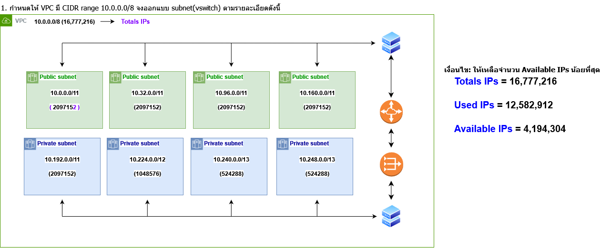
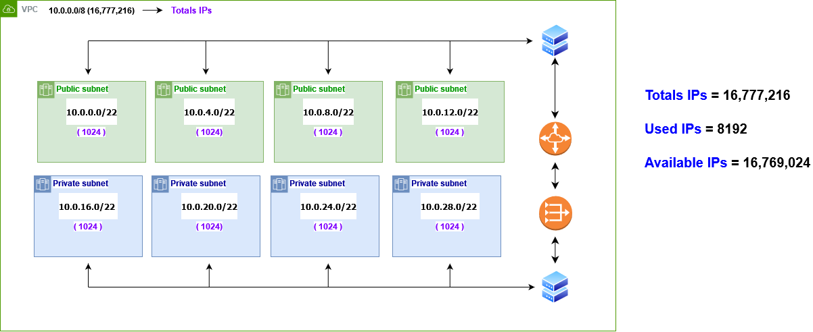

# **LAB Assignment 5🐥**
### 1.กำหนดให้ VPC มี CIDR range 10.0.0.0/8 จงออกแบบ subnet(vswitch) ตามรายละเอียดดังนี้
* เงื่อนไข: ให้เหลือจำนวน Available IPs น้อยที่สุด
🪶🪶🪶🪶🪶🪶🪶🪶🪶🪶🪶🪶🪶🪶🪶🪶🪶🪶🪶🪶🪶🪶🪶🪶🪶

### 2.กำหนดให้ VPC มี CIDR range 10.0.0.0/8 จงออกแบบ subnet(vswitch) ตามรายละเอียดดังนี้
* เงื่อนไข: ให้เหลือจำนวน Available IPs มากที่สุด

🌷🌷🌷🌷🌷🌷🌷🌷🌷🌷🌷🌷🌷🌷🌷🌷🌷🌷🌷🌷🌷🌷🌷🌷🌷🌷🌷
