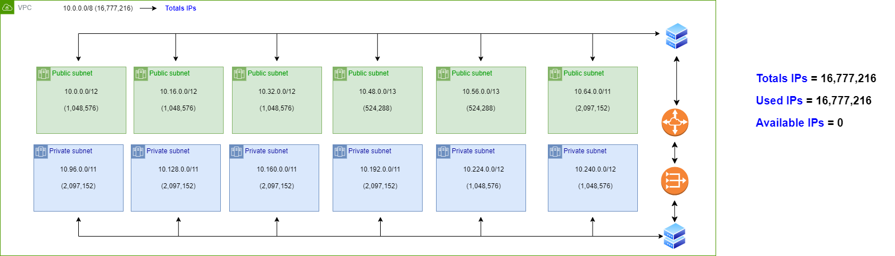
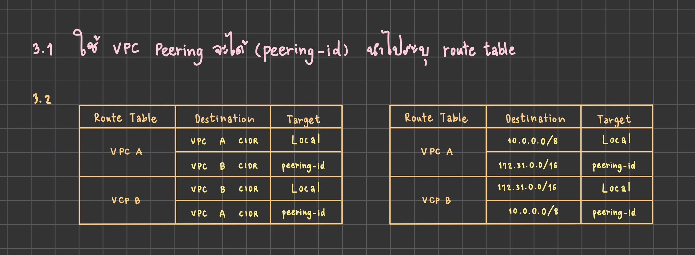
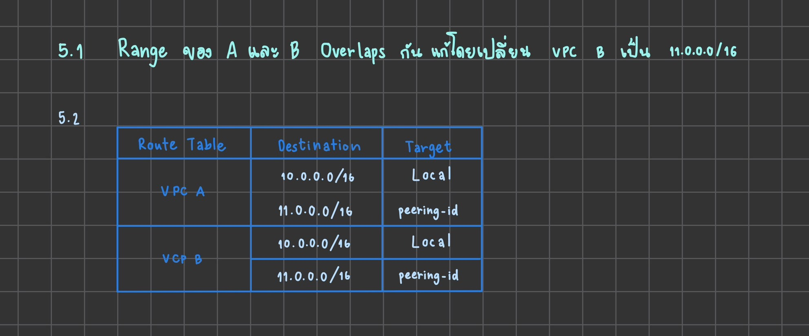
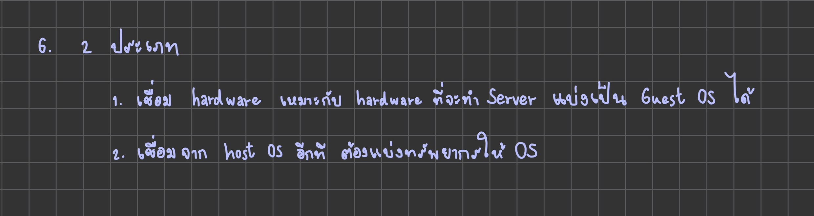
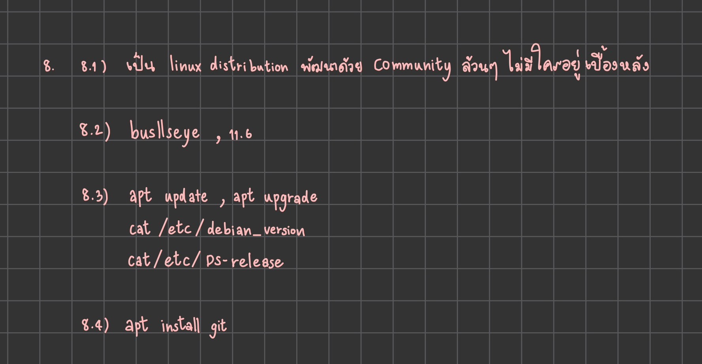
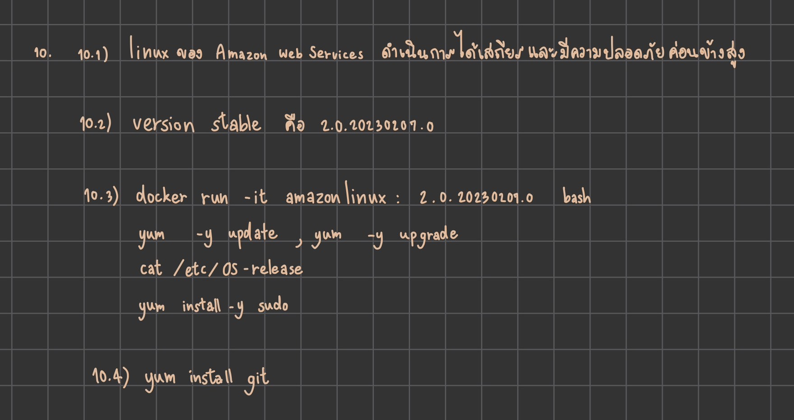
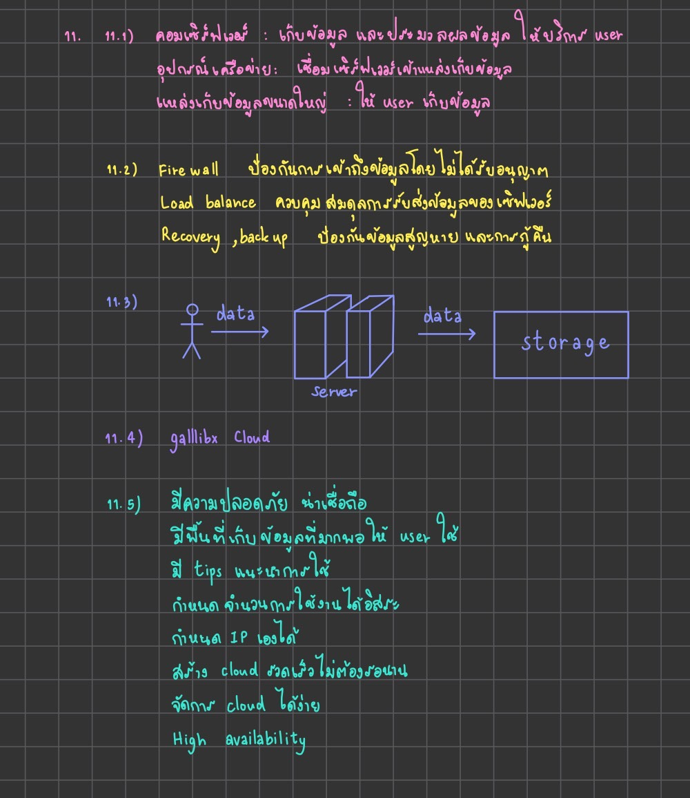

# **LAB Assignment 6 ☠️**
## *🪂6303051633077 กิติยาพร จันทรโอภาส เลขที่ 41 🌷*
#
### **1.กำหนดให้ VPC มี CIDR range 10.0.0.0/8 จงออกแบบ subnet(vswitch) ตามรายละเอียดดังนี้**
> 1.1)public 6 zone พร้อมระบุจำนวน ip ที่ใช้ได้

> 1.2)private: 6 zone พร้อมระบุจำนวน ip ที่ใช้ได้

> 1.3)ระบุจำนวน ip ที่ยังเหลือ

> เงื่อนไข: ให้เหลือจำนวน Available IPs น้อยที่สุด

#

### **2.กำหนดให้ VPC มี CIDR range 172.31. 0.0/16 จงออกแบบ subnet(vswitch) ตามรายละเอียดดังนี้**
> 2.1)public 4 zone พร้อมระบุจำนวน ip ที่ใช้ได้

> 2.2)private: 4 zone พร้อมระบุจำนวน ip ที่ใช้ได้

>2.3)ระบุจำนวน ip ที่ยังเหลือ

> เงื่อนไข: ให้เหลือจำนวน Available IPs น้อยที่สุด

#

### **3.จากคำตอบข้อ 1 และ 2 ให้ตอบคำถามย่อยต่อไปนี้**
> 3.1)ต้องใช้ Service อะไรที่ทำให้ VPC จากข้อที่ 1 และ 2 สามารถรับส่งข้อมูลถึงกันได้
> 3.2)จงวาดตาราง Route Table พร้อมระบุการ ค่าให้เรียบร้อย

#
### **4.(optional)ให้ออกแบบระบบซื้อขายของออนไลน์โดยมีองค์ประกอบดังนี้**

    4.1) สินค้า (product), ตะกร้าสินค้า(cart), จ่ายเงิน(payment), การขนส่งสิ่นค้า(Shipping), ผู้ใช้ (user)

    4.2) Database Service
    4.3) สามารถรองรับผู้ใช้งานได้จำนวนมหาศาล (แบบง่าย)

#
### **5.กำหนดให้ VPC A มี CIDR (10.0.0.0/16) และ VPC B มี CIDR (10.0.0.0/20)จงตอบคำถามต่อไปนี้**

>5.1)VPC A และ VPC B สามารถ peering กันได้หรือไม่ หากไม่ได้จงบอกเหตุผล

>5.2)กรณีถ้า Peering ได้ จะต้องทำอย่างไร ให้ service ที่อยู่ภายใน VPC ทั้งสองสามารถติดต่อสื่อสารกันได้

>5.3)ให้วาดรูป architecture ประกอบ

>5.4)(Optional) ใส่ component อื่นๆ ให้ครบ เช่น LB, Compute Engine, NatGW

#
### **6.)Hypervisor มีกี่ประเภทแต่ละประเภทคืออะไรบ้าง แล้วประเภทไหนที่ Computer ของเราใช้งานในการเปิด emulator (อยากให้ตอบตามความเข้าใจ ห้าม copy มาตอบ)**

#
### **7.(optional) ให้ออกแบบ architecture ที่นำ application ของเรามาเชื่อมต่อกับ Cloud (ไม่มีผิดไม่มีถูกอยากให้ลองออกแบบกันมาว่าถ้า application ของเราขึ้นไปอยู่บน cloud จะมีหน้าตาแบบไหน)**
#
### **8.ให้ตอบคำถามต่อไปนี้เกี่ยวกับ Debian**
>8.1)Debian คืออะไร

>8.2)version stable ล่าสุดมีชื่อเล่นว่าอะไร

>8.3)Package Manager ต้องใช้คำสั่งอะไร

>8.4)หากต้องการติดตั้ง git ควรใช้คำสั่งอะไร

#
### **9.ให้ตอบคำถามต่อไปนี้เกี่ยวกับ Alpine**
>9.1)Alpine คืออะไร

>9.2)version stable ล่าสุดมีคือ version อะไร

>9.3)Package Manager ต้องใช้คำสั่งอะไร

>9.4)หากต้องการติดตั้ง git ควรใช้คำสั่งอะไร

#
### **10.ให้ตอบคำถามต่อไปนี้เกี่ยวกับ Amazonlinux**
>10.1)Amazonlinux คืออะไร

>10.2)version stable ล่าสุดมีชื่อเล่นว่าอะไร

>10.3)Package Manager ต้องใช้คำสั่งอะไร

>10.4)หากต้องการติดตั้ง git ควรใช้คำสั่งอะไร

#
### **11.หากเราต้องการสร้างบริษัทเป็นผู้ให้บริการ Cloud จงตอบคำถามต่อไปนี้**
>11.1)เราควรมีอุปกรณ์ Hardware อะไรบ้าง พร้อมอธิบาย

>11.2)เราควรมี Software อะไรบ้าง พร้อมอธิบาย

>11.3)วาดภาพ Architecture ของ Cloud Service ของเรา

>11.4)ชื่อ Cloud ที่เราให้บริการมีชื่อว่าอะไร

>11.5)Cloud ของเรามี service อะไร ที่ให้บริการผู้ใช้งานได้บ้าง

🪲🪲🪲🪲🐠🐠🐠🐠🐠🦤🦤🐤🐤🐤🐤🐻‍❄️☠️🪶🖌️🖌️🖌️

    